# Control ws281x LEDs from an Android tablet and a MIDI sequencer

The following shows live control of ws281x LEDs using a tablet. The three
sliders control the intensity of red, green, and blue colors. On the right is an
Android tablet running a MIDI mixer application. On the left is an LED stick
connected to a Raspberry Pi B+.

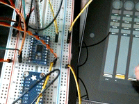

The following shows automated playback using a MIDI sequencer program running
on a Linux PC controlling the same LEDs. The top of the screen shows the
sequencer with waveforms for each color track. The sequencer sends MIDI volume
commands based on the waveforms specified for each track. The bottom shows the
same LED stick under control of the sequencer.

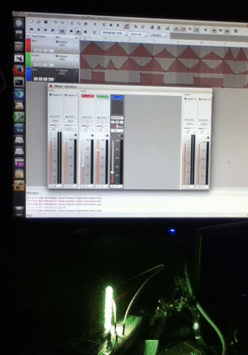

## Live LED control

The system block diagram shows the flow of MIDI events from Android tablet to
LEDs. The boxes in blue are hardware: Android tablet, WiFi router,
Raspberry Pi, and ws281x LEDs. Adafruit Neopixel LEDs are a well known brand of
ws281x LEDs. The boxes in green are software programs such as TouchDAW (MIDI
controller program for Android), multimidicast, and node.js. The ellipses in
yellow are communcation media.

Pressing a key or moving a slider in TouchDAW generates MIDI events which are
sent over WiFi. The router relays the events to the Raspberry Pi. The
multimidicast program receives the events and pushes them into the Linux MIDI
system. The node.js Javascript program receives the events and controls the
LEDs connected to GPIO pin #18.

Note the absence of MIDI cables, connectors, and serial ports. The MIDI
events travel over Ethernet and WiFi so the configuration is only limited by
the Ethernet/WiFi router.

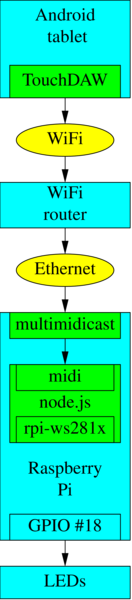 

### Install TouchDAW on Android

[TouchDAW](http://www.humatic.de/htools/touchdaw/)

The free version in the app store which works fine for testing. The full
version is worth the price if you plan to use it for more than testing.

There may be other Android MIDI applications that work just as well but this is
the first one found with multicast MIDI support that works in this
configuration.

#### Configure TouchDAW for UDP multicast over WiFi

The following is the short answer.

```sh
Setup -> MIDI Utilities -> MIDI Connection -> WiFi -> Multicast
```

If the above is too terse, try the screen shots.

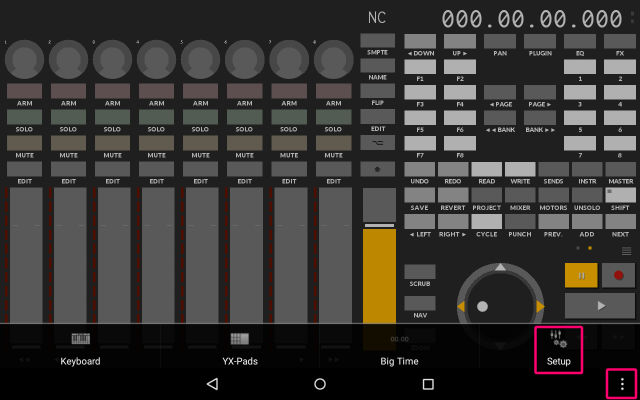

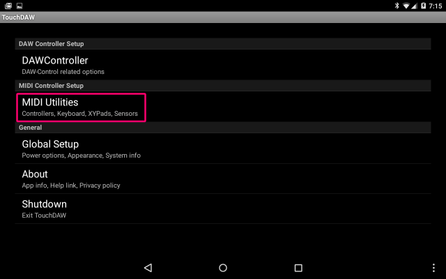

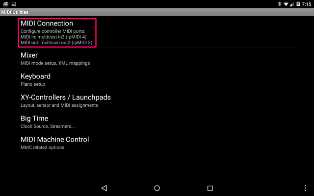

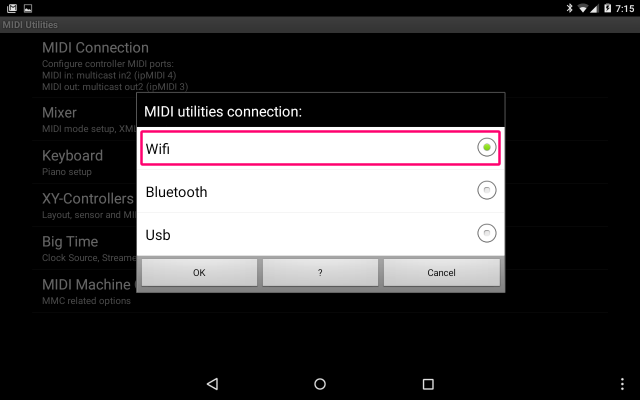

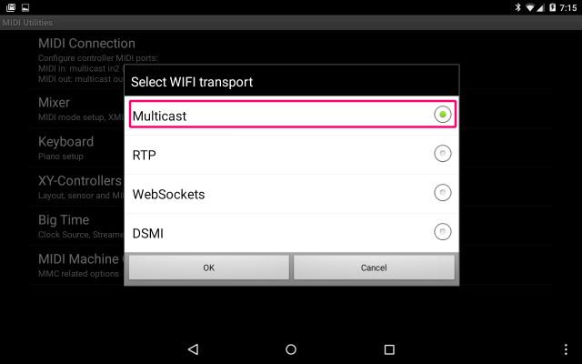

#### Configure TouchDAW for MIDI mixer mode

In the main DAW screen (the one with 9 sliders and lots of buttons), be sure to
enable MIDI mode. Press the key above the right most slider. The key has a fat
arrow pointing up. The key color is yellow in MIDI mode.

IMPORTANT: This must be done every time the program is opened. There is no
way to lock this screen in MIDI mode.

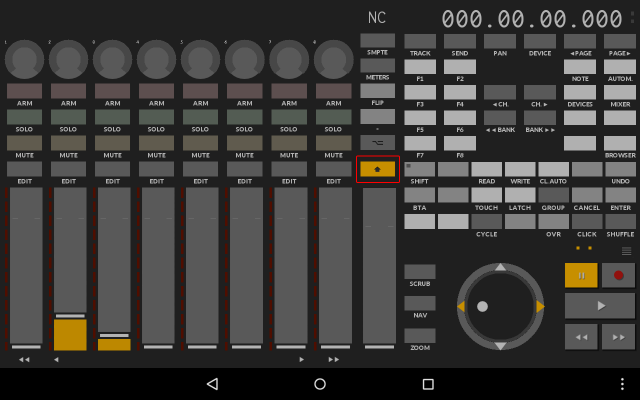

### Install MIDI network support on Raspberry Pi

If the Pi is running the GUI, install qmidinet from the Raspian repos.

```sh
$ sudo apt-get install qmidinet
$ ./qmidinet -n 10 &
```

If the Pi is running command line mode, or if qmidinet does not work, download
and run [multimidicast](http://llg.cubic.org/tools/multimidicast/)

```sh
$ wget http://llg.cubic.org/tools/multimidicast/multimidicast-1.3.tar.gz
$ tar xf multimidicast-1.3.tar.gz
$ cd multimidicast-1.3
$ sudo apt-get install libasound2-dev
$ make
```

At this point, MIDI events from TouchDAW should be available on the Pi. Run
multimidicast and press TouchDAW keys and look for output similar to the
following.

```sh
$ ./multimidicast
NETW event: Port 03 192.168.1.xx: 90 2F 05 
NETW event: Port 03 192.168.1.xx: 80 2F 00
```

If no events appear, switch to the keyboard or YX-Pads screens. These screens
always send MIDI. The DAW screen could be in DAW mode which does not generate
MIDI. See this [section](#configure-touchdaw-for-midi-mixer-mode) for
instructions on turning on MIDI mode in the DAW screen. The DAW screen is the
first screen that appears when TouchDAW opens.

If no events appear even when using the keyboard screen, see this
[section](#configure-touchdaw-for-udp-multicast-over-wifi) for instructions on
enabling multicast MIDI mode.

Assuming multimidicast is producing MIDI events, press ^C to stop it. Next run
it in the background. multimidicast or qmidinet must be running to use
TouchDAW.

```sh
$ multimidicast &
```

### Assemble LED hardware

See the Adafruit tutorial on connecting up the LEDs to the Pi. But skip the
software section because LED driver software will be installed by node.js.

https://learn.adafruit.com/neopixels-on-raspberry-pi/wiring

My Pi has only eight LEDs and is powered using a 5V 2A power supply so the LEDs
are safely powered from the Pi. This will not work for more LEDs. Use a
separate power supply for more than eight LEDs. See [Adafruit's NeoPixel
guide](https://learn.adafruit.com/adafruit-neopixel-uberguide/) for more details.

 

### Install node.js

Install the latest version of node.js for the Pi. Follow the instructions on
this [page](http://node-arm.herokuapp.com/). As of this writing, the latest version is v0.12.1.

### Install midiled

midiled is the node.js Javascript program that reads MIDI events and controls
the LEDs. Note this program must be run as root using the sudo command.

```sh
$ git clone http://github.com:node-midiled
$ cd node-midiled
$ npm install
$ sudo node midiled.js
```

midiled uses the rpi-ws281x package to control the ws281x (NeoPixel) LEDs and
the midi package to access the Linux MIDI system.

### Live LED control using a tablet

The tablet should now be able to control the LEDs connected to the Pi. Move
TouchDAW sliders 1, 2, or 3. Slider 1 controls the red LED color, slider 2
controls the green LED color, and slider 3 controls the blue LED color.

If it does not work, please review the previous steps.

## MIDI sequencer LED control

If you want to synchronize LEDs with an audio track, [Qtractor](http://qtractor.sourceforge.net/qtractor-index.html) is one
application suitable for this task. Qtractor is an audio/MIDI multi-track
sequencer. This section explains how to configure Qtractor so it controls the
LEDs by sending MIDI events to the Pi. The PC running Qtractor must be
connected to the same WiFi/Ethernet router as the Pi. The PC, TouchDAW, and the
Pi exchange MIDI events over Ethernet/WiFi.


The final configuration should look like the following diagram. The Android
tablet running TouchDAW provides live control. Qtractor on Linux provides LED
control synchronized to music.

More than one Pi each driving a string of LEDs can be included because they all
communicate over Ethernet/WiFi. The diagram shows a second Pi for this reason.

If the Pi's are configured with WiFi instead of Ethernet, it is possible, with
a large enough battery, to make a wearable device including the LEDs, Pi,
and WiFi adaptor.

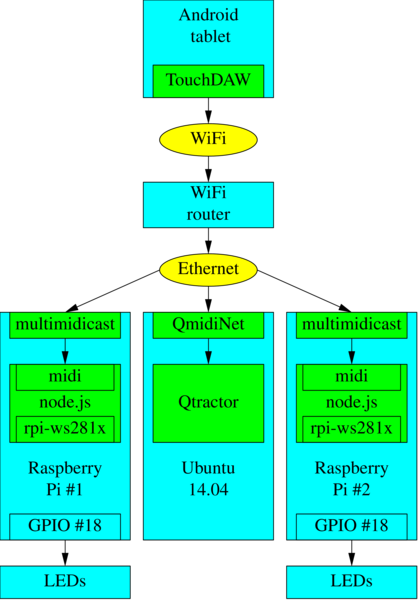

### Install MIDI Multicast

NOTE: This is not a repeat of a previous step. The previous step installed
qmidinet/multimidicast on the Pi. This section covers configuring QmidiNet on a
PC running Ubuntu.

```sh
$ sudo apt-get install qmidinet
$ qmidinet -n 10
```
Create at least 10 channels, just in case.

Normally, this should be run in the background like this 

```sh
$ qmidinet -n 10 &
```

but for now leave it running the foreground because it produces useful debug
information. When the Qtractor sliders are configured, qmidinet should produce
a stream of numbers indicating it is receiving MIDI data. If nothing happens,
check the Qtractor Connection window to make sure Qtractor is connected to
QmidiNet.

Note QmidiNet running on the PC is compatble with multimidicast running
on the Pi. And it is compatible with TouchDAW's built-in MIDI multicast feature.

### Install Qtractor

See the [Qtractor](http://qtractor.sourceforge.net/qtractor-index.html) site
for details. Qtractor 0.6.7 built from source was used for this test on a PC
running Ubuntu 14.04 64-bit but installing Qtractor from the Ubuntu repos
should also work.

### Configure Qtractor

After the following configuration, Qtractor should look like this.

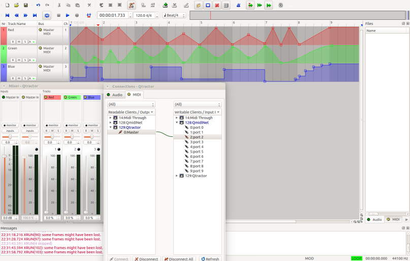

Run Qtractor.

Create a New session then save the session as "ledtest".

File -> New -> Save As "ledtest"

Normally, the first track would be a music track followed by the LED control
tracks but to keep this README as short as possible, the music track is not
created.

#### Create RED track

Track -> Add Track

```sh
Name: Red
Type: MIDI
Channel 1
View/Colors
Foreground: #FF0000, background: #000000
```

Note the Channel number and forground color are different for each
track.

#### Create GREEN track
Add Track

```sh
Name: Green
Type: MIDI
Channel 2
View/Colors
Foreground: #00FF00, background: #000000
```

#### Create BLUE track
Add Track

```sh
Name: Blue
Type: MIDI
Channel 3
View/Colors
Foreground: #0000FF, background: #000000
```

Press ^S to save the configuration.

#### Enable Automation on each track

Each track has four buttons: R, M, S, A. A is for automation. 
For each track do the following.

* Click on the A button then Select: (Red, Green, Blue) Volume. The volume
controls the LED brightness.

* Click on the A button then enable Play and Play All.

* Set the Mode to any one of Hold, Linear, Spline. Spline
produces smooth curves.

* Set Mode: Color to set the waveform color to match the track color.

Press ^S to save the configuration.

#### Configure MIDI Connections

Press F8 to open the connections window. Click on the MIDI tab. On the
left side, open Qtractor so 0:Master is revealed. On the right side
open QmidiNet so its ports are revealed. Draw a connection from
Qtractor 0:Master to QmidiNet 2:port 2.

On the left side, open QmidiNet so all 10 ports are shown. On the right side
open Qtractor so 0:Master is shown. Draw a connection from QmidiNet
2:port 2 to Qtractor 0:Master.

At this point, Qtractor should be able to send MIDI over Ethernet and
WiFi. Close the window. MIDI over Ethernet/WiFi is used to communicate
with the Raspberry Pi driving the LEDs.

In addition, moving the sliders on the tablet should also move the sliders in
Qtractor.

Press ^S to save the configuration.

#### Open Mixer Window

Press F9 to open the mixer window. Sliders for the Red, Green, and Blue tracks
should be visible. Assuming the Raspberry Pi and LEDs are up and running,
moving the sliders should change the LED colors. If not, go back and check all
previous steps and check all steps on the Pi.

QmidiNet should produce a stream of numbers when the sliders are
moving. This indicates Qtractor is sending MIDI events to the QmidiNet.
If not, check the Connections window.

Assuming the sliders are working, the next step is to create
automation curves to control the LEDs.

#### Automation curves

Edit -> Select Mode -> Automation. This enable Automation Edit mode.

For each track, click on the timeline to create nodes. Qtractor will 
connect the nodes using lines in Linear mode, curves in Spline mode,
and levels in Hold mode. Try different modes to see what they do.
In the screen shot, the Red track is in Linear mode, the Green track
is in Spline mode, and the Blue track is in Hold mode.

Once the tracks are set, press the Play button. The sliders and the
LEDs should change based on the automation curves. If not, click on
each track's A button and make check marks next to Play and Play All.

This completes the demonstration of sequencer LED control.

